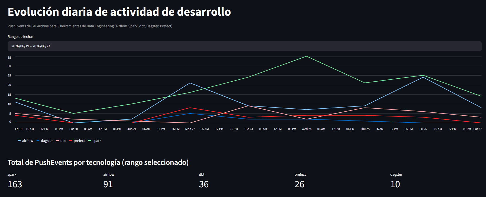

# dev-trends

> Plataforma de datos que mide la **actividad de desarrollo** de tecnologías de
> software a partir de fuentes públicas (GitHub, vía GH Archive). Pipeline de
> Data Engineering de extremo a extremo: ingesta en streaming, procesamiento
> distribuido, arquitectura medallion sobre un data lake en AWS y modelado
> analítico.

> **Estado: V1 completa.** Pipeline de punta a punta con datos reales: GH Archive →
> Kafka → Spark Structured Streaming → Silver/Gold en S3 (Delta) → dbt → Athena →
> Streamlit. Las ampliaciones (más fuentes, más tecnologías, calidad de datos,
> observabilidad) quedan para siguientes fases.

---

## Qué es

`dev-trends` ingiere el flujo de eventos públicos de GitHub (pushes, pull
requests, releases, etc.) y lo transforma en métricas de actividad por
tecnología, para responder preguntas como *qué herramientas de su categoría
crecen en actividad de desarrollo y cuáles se estancan*.

El proyecto está diseñado como demostración de un pipeline de Data Engineering
moderno de principio a fin, con las prácticas que se esperan en producción:
arquitectura por capas, transición de batch a streaming, infraestructura como
código y modelado analítico desacoplado.

> **Nota sobre qué se mide.** GitHub refleja *actividad de desarrollo* (commits,
> PRs, releases), no *adopción* en producción. `dev-trends` mide lo primero. La
> medición de adopción (vía descargas de paquetes) está contemplada como
> ampliación futura.

---

## Stack

| Capa | Tecnología |
|---|---|
| Fuente | GH Archive (eventos públicos de GitHub) |
| Ingesta | Apache Kafka (batch → streaming) |
| Procesamiento | Apache Spark (Structured Streaming) |
| Almacenamiento | AWS S3 + Delta Lake (arquitectura medallion) |
| Catálogo | AWS Glue Data Catalog |
| Modelado | dbt |
| Consulta | AWS Athena |
| Visualización | Streamlit |
| Infraestructura | Terraform |
| Orquestación local | Docker Compose |

**Entorno híbrido:** el cómputo (Kafka, Spark, dbt) corre en local sobre Docker;
el almacenamiento y la consulta (S3, Glue, Athena) viven en AWS.

---

## Arquitectura

```
GH Archive ──▶ Kafka ──▶ Spark ──▶ S3 / Delta (medallion) ──▶ Athena ──▶ Dashboard
                                   Bronze → Silver → Gold
                                                 (dbt)

           Terraform aprovisiona la infraestructura AWS (S3, Glue, Athena, IAM)
```

- **Bronze:** eventos crudos de GH Archive, tal cual.
- **Silver:** eventos normalizados y filtrados (un evento por fila, tipado).
- **Gold:** agregados analíticos por tecnología y periodo, modelados con dbt.

### Esquema Silver

Un evento por fila, particionado por fecha (`year`/`month`/`day`). Congelado desde
la Fase 1 para que dbt pudiera construirse encima sin romper capas anteriores:

| Columna | Tipo | Descripción |
|---|---|---|
| `event_id` | string | Id del evento en GitHub, único. |
| `technology` | string | Tecnología asociada al repositorio (`airflow`, `spark`, `dbt`, `dagster`, `prefect`). |
| `event_type` | string | Tipo de evento normalizado (`push`, `pull_request`, `release`, `watch`). |
| `repository` | string | Repositorio de origen (`org/repo`). |
| `organization` | string | Organización, derivada de `repository`. |
| `created_at` | timestamp | Momento del evento en GitHub. |
| `year` / `month` / `day` | int | Partición derivada de `created_at`. |

No incluye el actor del evento (PII, y no aporta a la pregunta de actividad por
tecnología).

---

## Estado del proyecto

Construcción por fases. El orden prioriza las tecnologías núcleo y deja un
pipeline funcional de extremo a extremo lo antes posible.

- [x] **Fase 1 — Spark (batch):** ingesta de ficheros de GH Archive, parseo y
      normalización a Silver. (La agregación a Gold inicial era provisional; la
      asume dbt en la Fase 3.)
- [x] **Fase 2 — Kafka + streaming:** ingesta vía Kafka y migración a Spark
      Structured Streaming (Kafka → Bronze → Silver, con trigger `availableNow`).
      La agregación a Gold se reserva para dbt (Fase 3).
- [x] **Fase 3 — dbt:** modelado de la capa Gold como *star schema* (dimensiones
      `dim_technology`, `dim_date`, `dim_event_type`, `dim_source` y hecho
      `fact_github_activity`) sobre Silver, con tests de dbt.
- [x] **Fase 4 — Terraform:** infraestructura AWS como código (S3 del medallion,
      Glue Data Catalog, workgroup de Athena con tope de escaneo, IAM de mínimo
      privilegio y alerta de presupuesto).
- [x] **Cutover a AWS:** el pipeline escribe Silver y Gold en S3 (Delta) vía `s3a`;
      el Gold se registra en el Glue Data Catalog y se consulta desde Athena, que
      lee Delta de forma nativa (sin generar manifiestos).
- [x] **Dashboard:** visualización en Streamlit, con la evolución diaria de actividad
      por tecnología y el total por tecnología para el rango seleccionado, leyendo de
      Athena.

### Ampliaciones futuras

Descargas de PyPI como segunda fuente (para medir adopción, no solo actividad),
más categorías de tecnologías, validación de calidad de datos, observabilidad y
un dashboard analítico en Power BI.

---

## Puesta en marcha

> Las instrucciones detalladas se añadirán conforme avance la implementación.

**Requisitos previos:**

- Docker y Docker Compose
- Python 3.11+
- Terraform 1.6+ (para aprovisionar la infraestructura AWS)
- Una cuenta de AWS (las capas de almacenamiento usan el free tier)
- Credenciales de AWS configuradas (variables de entorno o `~/.aws/credentials`)

> Las credenciales de AWS **nunca** se versionan. Consulta `.gitignore` y usa un
> fichero `.env` local (excluido del control de versiones).

### Flujo local (V1, streaming)

El pipeline de streaming corre en local sobre Kafka (Docker) y Spark. El esquema
medallion se construye en dos *queries* de streaming encadenadas (Kafka → Bronze,
Bronze → Silver):

```bash
make up                              # levanta Kafka (KRaft) en Docker
make topic                           # crea el topic github.push.raw

# Ingesta: publica los PushEvent de una hora de GH Archive en Kafka
make produce DATE=2024-01-15 HOURS=0-0

# Streaming Kafka → Bronze → Silver (Delta)
make stream-bronze
make stream-silver                   # Silver en local (data/silver)

make down                            # detiene Kafka
```

> Se desarrolla con **1 hora** de datos; el mismo flujo escala a 1 día o más
> cambiando solo `DATE`/`HOURS`, sin tocar la lógica de transformación.

> **Entorno híbrido (Silver en S3):** `make stream-silver-s3` escribe el Silver en
> `s3a://<bucket>/silver` con el perfil de mínimo privilegio (requiere
> `DEV_TRENDS_S3_BUCKET`); Bronze y los checkpoints permanecen en local.

El pipeline **batch** original (Fase 1) sigue disponible como alternativa:

```bash
make pipeline DATE=2024-01-15 HOURS=0-0
```

> El pipeline batch produce **Silver**; la agregación a Gold la construye dbt.

### Modelado analítico con dbt

dbt construye la capa **Gold** como *star schema* sobre el Silver ya escrito, con el
adapter `dbt-spark` (método `session`). Las dimensiones y el hecho
`fact_github_activity` se materializan como tablas Delta en **S3**, y responden la
pregunta de V1: *evolución diaria de actividad de desarrollo*.

```bash
export DEV_TRENDS_S3_BUCKET=<bucket-medallion>   # p. ej. dev-trends-medallion-<account_id>
make dbt-build    # seeds + modelos + tests, escribiendo el Gold en s3a://<bucket>/gold
make dbt-parse    # valida el proyecto sin conexión (igual que la CI)
```

> `make dbt-build` usa el perfil AWS `dev-trends-pipeline` (mínimo privilegio). El
> nombre del bucket se pasa por `DEV_TRENDS_S3_BUCKET` (no se versiona: lleva el
> identificador de cuenta). Los reruns son idempotentes.

### Consulta con Athena

El Gold en S3 se registra en el Glue Data Catalog para consultarlo desde Athena, que
lee Delta de forma nativa (sin generar manifiestos):

```bash
make athena-register    # registra las tablas Gold en Glue (solo la primera vez)
```

> El registro es de **una sola vez**: tras cada `dbt build` posterior, Athena ya lee
> la versión nueva de cada tabla directamente del log de transacciones de Delta, sin
> necesidad de volver a registrarla.

A partir de ahí Athena responde la pregunta de V1 agregando el hecho por día y
tecnología, dentro del tope de datos escaneados del workgroup.

### Dashboard

Un dashboard en Streamlit, en local, lee la capa Gold desde Athena y muestra la
evolución diaria de actividad por tecnología para un rango de fechas seleccionable,
con el total de eventos por tecnología en ese rango:

```bash
make dashboard
```

> Usa el perfil AWS `dev-trends-pipeline` y el mismo workgroup/base de datos de
> Athena que el resto del pipeline. La consulta se cachea en la sesión de Streamlit
> para no volver a escanear datos en cada interacción.



### Infraestructura AWS con Terraform (Fase 4)

La infraestructura de almacenamiento y consulta se declara como código en `infra/`:
los buckets S3 del medallion y de resultados de Athena, la base de datos del Glue
Data Catalog, el workgroup de Athena (con tope de datos escaneados como guarda de
coste), un usuario y una política IAM de mínimo privilegio para el pipeline, y una
alerta de presupuesto mensual.

```bash
cd infra
cp example.tfvars terraform.tfvars   # y pon tu email para la alerta de presupuesto
terraform init
terraform plan
terraform apply
```

> Requiere credenciales de AWS con permisos para crear estos recursos. El estado de
> Terraform (`terraform.tfstate`), el `terraform.tfvars` y cualquier `*.tfvars` con
> valores propios **no se versionan**; sí se versiona `example.tfvars` como plantilla.

Para revisar el proyecto **sin credenciales** (igual que la CI):

```bash
cd infra
terraform fmt -check
terraform init -backend=false
terraform validate
```

---

## Calidad de código

El proyecto sigue prácticas estándar de la industria:

- Formateo y linting con `ruff`
- Tests con `pytest`
- Hooks de `pre-commit`
- Tareas comunes automatizadas con `Makefile`
- Integración continua con GitHub Actions (lint, tests y validación de Terraform en cada push/PR)

---

## Licencia

MIT — ver [`LICENSE`](LICENSE).
