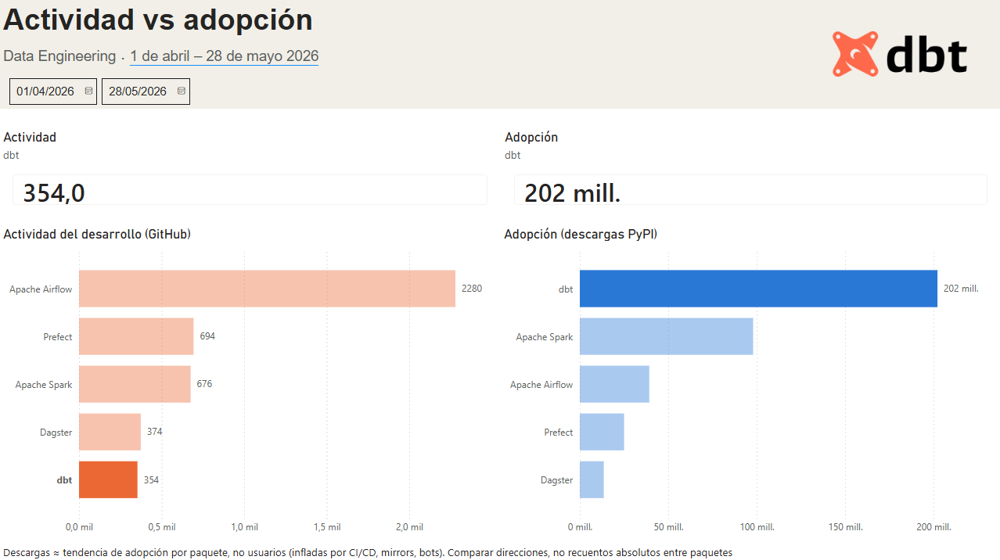
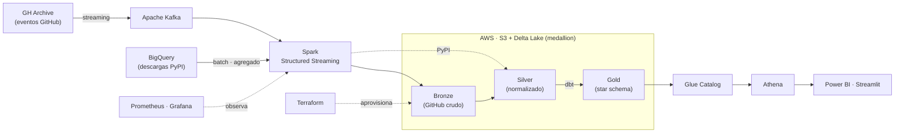
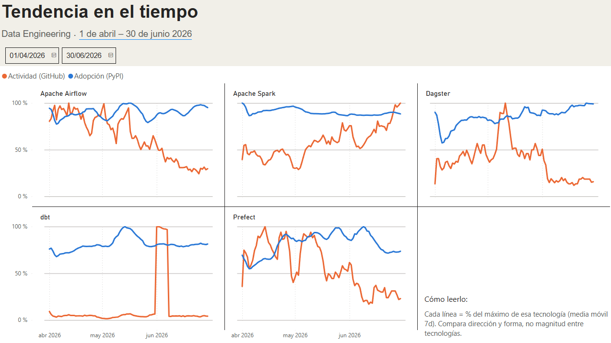
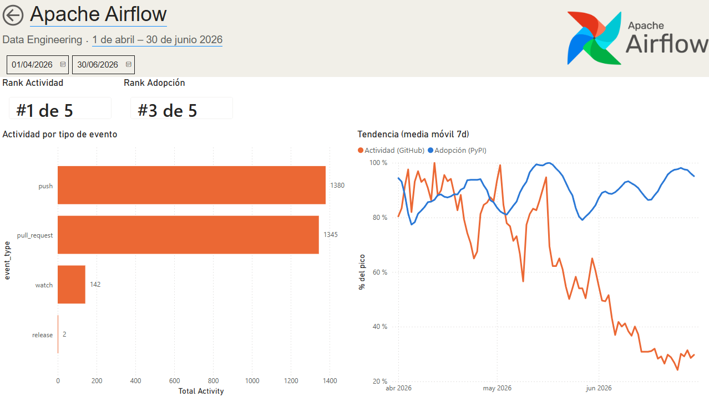
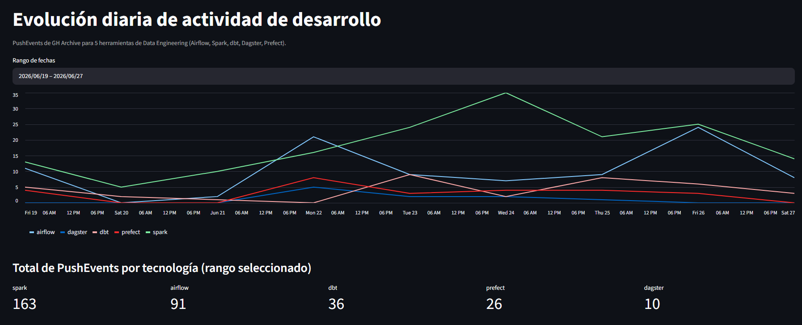

# dev-trends

> Plataforma de Data Engineering que mide la **actividad de desarrollo** y la
> **adopción** de tecnologías de software cruzando dos fuentes públicas: eventos de
> GitHub (vía GH Archive) y descargas de PyPI (vía BigQuery). Pipeline de extremo a
> extremo con ingesta en *streaming*, procesamiento distribuido, arquitectura
> *medallion* sobre un *data lake* en AWS, modelado analítico con dbt, gate de
> calidad, observabilidad y reprocesamiento dirigido.

[](https://github.com/AaronPrado/dev-trends/actions/workflows/ci.yml)
[](LICENSE)
[](https://www.python.org)




---

## Índice

- [Qué es y qué pregunta responde](#qué-es-y-qué-pregunta-responde)
- [Lo que demuestra](#lo-que-demuestra)
- [Arquitectura](#arquitectura)
- [Stack](#stack)
- [Capacidades](#capacidades)
- [El dashboard](#el-dashboard)
- [Hallazgos](#hallazgos)
- [Puesta en marcha](#puesta-en-marcha)
- [Esquema de datos](#esquema-de-datos)
- [Calidad de código](#calidad-de-código)
- [Posibles evoluciones](#posibles-evoluciones)
- [Licencia](#licencia)

---

## Qué es y qué pregunta responde

`dev-trends` combina dos señales públicas por tecnología:

- **Actividad de desarrollo** — eventos de GitHub (*pushes*, *pull requests*,
  *releases*, *watches*) vía GH Archive: cuánto se **construye** una herramienta.
- **Adopción** — descargas de paquetes de PyPI vía BigQuery: cuánto se **usa**.

Cruzando ambas responde preguntas que ninguna fuente contesta sola: qué
herramientas se construyen mucho pero se usan poco (emergentes), cuáles se usan
mucho con menos desarrollo (maduras), y hacia dónde va cada una en el tiempo.

El proyecto está construido como demostración de un pipeline de Data Engineering
moderno de principio a fin, con las prácticas que se esperan en producción:
ingesta en *streaming*, arquitectura por capas, modelado analítico desacoplado,
validación de calidad, observabilidad e infraestructura como código.

> **Nota sobre las métricas.** GitHub mide *actividad de desarrollo* (commits, PRs,
> releases), no adopción en producción. Las descargas de PyPI son un proxy de *uso*
> inflado por CI/CD, *mirrors* y bots: se leen como **tendencia relativa por
> paquete**, no como recuento de usuarios. Por eso se reportan **por fuente** y se
> comparan por *ranking*, no por magnitud absoluta.

<sub>El recorrido vertical inicial (etiquetado en `v1.0.0`) cerró el pipeline de
extremo a extremo sobre una sola fuente y una pregunta de *actividad*. La versión
actual lo ensancha a dos fuentes —añadiendo la señal de *adopción*—, un gate de
calidad de datos, observabilidad del *streaming* y reprocesamiento dirigido.</sub>

---

## Lo que demuestra

- **Ingesta en *streaming* real** — GH Archive → Kafka → Spark Structured
  Streaming, con procesamiento por micro-batches y *checkpointing*. La lógica de
  transformación es la misma en *batch* y en *streaming*: no es un *batch*
  disfrazado.
- **Dos señales, una pregunta** — actividad (GitHub) y adopción (PyPI) modeladas
  sobre las **mismas dimensiones conformadas**, para comparar qué se construye
  frente a qué se usa sobre el mismo periodo.
- **Modelado analítico desacoplado con dbt** — la capa Gold es un *star schema*
  aislado de la normalización a Silver, con dimensiones conformadas, hechos a grano
  diario y tests versionados.
- **Gate de calidad de datos** — validez estructural que **detiene** el *build*
  ante corrupción, más detección de **anomalías de negocio** que avisa sin frenar,
  con los tests nativos de dbt y `dbt-expectations`.
- **Observabilidad del *streaming*** — cada micro-batch publica sus métricas
  (latencia, filas procesadas, *lag* de consumo de Kafka) a Prometheus,
  visualizadas en un Grafana aprovisionado como código.
- **Reprocesamiento dirigido e idempotente** — relee una ventana de días desde
  Kafka y reescribe cada partición de Silver con `replaceWhere`, sin duplicar y sin
  depender del *checkpoint* del *stream*.
- **Infraestructura como código** — todo el AWS (S3 del *medallion*, Glue Data
  Catalog, workgroup de Athena con tope de coste, IAM de mínimo privilegio) se
  declara en Terraform.

---

## Arquitectura


```mermaid
flowchart LR
    GH["GH Archive<br/>(eventos GitHub)"] -->|streaming| K["Apache Kafka"]
    K --> SP["Spark<br/>Structured Streaming"]
    PY["BigQuery<br/>(descargas PyPI)"] -->|batch · agregado| SP

    subgraph AWS["AWS · S3 + Delta Lake (medallion)"]
        BR["Bronze<br/>(GitHub crudo)"]
        SV["Silver<br/>(normalizado)"]
        GD["Gold<br/>(star schema)"]
        BR --> SV
        SV -->|dbt| GD
    end

    SP --> BR
    SP -. PyPI .-> SV
    GD --> GL["Glue Catalog"]
    GL --> AT["Athena"]
    AT --> DASH["Power BI · Streamlit"]

    TF["Terraform"] -. aprovisiona .-> BR
    OBS["Prometheus · Grafana"] -. observa .-> SP
```

Arquitectura **medallion** sobre Delta Lake:

- **Bronze** — eventos crudos de GitHub, tal cual llegan de Kafka (solo la fuente de
  GitHub pasa por Bronze).
- **Silver** — datos normalizados y particionados por fecha: un evento de GitHub por
  fila, y las descargas de PyPI agregadas por día y paquete. Su esquema está
  **congelado** para que dbt construya encima sin romper capas anteriores.
- **Gold** — hechos analíticos a grano diario modelados con dbt:
  `fact_github_activity` (actividad) y `fact_pypi_downloads` (adopción), sobre
  dimensiones conformadas (`dim_technology`, `dim_date`, `dim_event_type`,
  `dim_source`).

**Entorno híbrido:** el cómputo (Kafka, Spark, dbt) corre en local sobre Docker; el
almacenamiento y la consulta (S3, Glue, Athena) viven en AWS. Así el pipeline
ejercita servicios *cloud* reales sin coste de cómputo continuo.

---

## Stack

| Capa | Tecnología |
|---|---|
| Fuentes | GH Archive (eventos de GitHub) · BigQuery (descargas de PyPI) |
| Ingesta | Apache Kafka (*streaming*) · cliente de BigQuery (agregación en origen) |
| Procesamiento | Apache Spark (Structured Streaming) |
| Almacenamiento | AWS S3 + Delta Lake (arquitectura *medallion*) |
| Catálogo | AWS Glue Data Catalog |
| Modelado | dbt |
| Calidad de datos | dbt tests · `dbt-expectations` |
| Consulta | AWS Athena |
| Visualización | Power BI (dashboard analítico) · Streamlit (dashboard local) |
| Observabilidad | Prometheus · Grafana (métricas del *streaming*) |
| Infraestructura | Terraform |
| Orquestación local | Docker Compose |

---

## Capacidades

### Ingesta en *streaming* (Kafka → Spark)

El pipeline ingiere los eventos de GitHub como un flujo: GH Archive se publica en un
*topic* de Kafka y Spark Structured Streaming lo consume en dos *queries* encadenadas
(Kafka → Bronze, Bronze → Silver), con *checkpointing* para reanudar sin duplicar.

La misma función de normalización `df -> df` alimenta el modo *batch* y el
*streaming*: el centro de la lógica no cambia al pasar de uno a otro. Se desarrolla
con **una hora** de datos y el mismo flujo escala a un día o más cambiando solo el
rango, sin tocar la transformación.

```bash
make up                              # levanta Kafka (KRaft) en Docker
make topic                           # crea el topic de eventos crudos
make produce DATE=2026-04-15 HOURS=15-15   # publica una hora de GH Archive en Kafka

make stream-bronze                   # Kafka → Bronze (Delta)
make stream-silver                   # Bronze → Silver (Delta), en local
make down                            # detiene Kafka
```

> **Silver en S3:** `make stream-silver-s3` escribe Silver en `s3a://<bucket>/silver`
> con el perfil AWS de mínimo privilegio; Bronze y los *checkpoints* permanecen en
> local.

### Segunda fuente: adopción vía PyPI (BigQuery)

La ingesta de PyPI consulta el dataset público de BigQuery, **agrega en origen**
(día × paquete) y trae solo el agregado a Silver, con guardas de coste: un *dry-run*
mide los bytes antes de gastar y `maximum_bytes_billed` es un tope duro. Con esta
fuente `dim_source` pasa a ser real y `dim_date` cubre la unión de rangos de ambas
fuentes; GitHub se *backfillea* a la misma ventana para comparar actividad y adopción
sobre el mismo periodo.

```bash
# Estimación de escaneo, sin ejecutar ni escribir (mide bytes en BigQuery):
python -m dev_trends.pipeline.pypi_downloads --start 2026-04-01 --end 2026-07-01 \
  --dry-run --project <tu-proyecto-gcp>

# Backfill real a Silver en S3 (requiere DEV_TRENDS_S3_BUCKET y DEV_TRENDS_GCP_PROJECT):
make pypi-ingest START=2026-04-01 END=2026-07-01

# GitHub a la misma ventana, idempotente por partición (replaceWhere):
make backfill-github START=2026-04-01 END=2026-07-01
```

> Las credenciales de GCP (ADC) viven en `~/.config/gcloud` y **nunca** se versionan.

### Modelado analítico con dbt

dbt construye la capa **Gold** como *star schema* sobre el Silver ya escrito, con el
adapter `dbt-spark` (método `session`). Las dimensiones conformadas y los hechos
`fact_github_activity` (actividad) y `fact_pypi_downloads` (adopción) se materializan
como tablas Delta en **S3**, a grano diario y sobre las mismas dimensiones. La
frontera Silver/Gold es limpia: la agregación vive en dbt, aislada de la
normalización.

```bash
export DEV_TRENDS_S3_BUCKET=<bucket-medallion>   # p. ej. dev-trends-medallion-<account_id>
make dbt-build    # seeds + modelos + tests, escribiendo Gold en s3a://<bucket>/gold
make dbt-parse    # valida el proyecto sin conexión (igual que la CI)
```

> El nombre del bucket se pasa por `DEV_TRENDS_S3_BUCKET` (no se versiona: lleva el
> identificador de cuenta). Los *reruns* son idempotentes.

### Calidad de datos

Un gate de calidad valida la capa **Silver** antes de consolidarla en los hechos de
**Gold**, con dos familias de reglas:

- **Validez estructural** (el contrato de Silver): cada evento tiene `event_id`
  único y no nulo, `technology`/`event_type`/`created_at` presentes, `event_type`
  dentro del dominio esperado y `repository` con formato `org/repo`. Si algo falla,
  el *build* **se detiene**: es corrupción y no debe llegar a los modelos.
- **Anomalías de negocio**: patrones que sesgan la interpretación aunque el dato sea
  correcto. Se emiten como **aviso** (no detienen el *build*): el dato es real, solo
  hay que no leerlo de forma ingenua.

Se implementa con los **tests nativos de dbt** más `dbt-expectations`: el pipeline ya
usa dbt para el modelado y los agregados que la detección necesita ya existen en
Gold, así que la validación vive junto a los datos que valida, sin añadir un motor
aparte.

Un ejemplo real: un test marca los días en que una tecnología acumula mucha actividad
de `push` con *pull requests* casi ausentes — la firma de la **automatización** (bots
o CI que empujan *commits* sin revisión), que no es desarrollo humano pero infla la
actividad. Sobre los datos reales señala **dbt el 2026-06-01: 931 *pushes* y 0 PRs**,
un día que vale **22 veces la mediana diaria de ese mes**. El test opera a grano
**diario** por diseño: sobre el agregado mensual ese pico pasa inadvertido.

```bash
make dbt-deps    # instala dbt-expectations, una sola vez
make dbt-build   # construye Gold y ejecuta TODOS los tests (estructurales + anomalías)
make dbt-test    # solo los tests, sobre el Gold ya construido
```

### Observabilidad del *streaming* (Prometheus / Grafana)

Las *queries* de *streaming* exponen sus métricas de ejecución a Prometheus,
visualizadas en un panel de Grafana. Un `StreamingQueryListener` traduce el progreso
de cada micro-batch a métricas: latencia de proceso, filas por micro-batch, ritmo de
entrada frente a ritmo de proceso, desglose de la latencia por fase interna, y el
**retraso de consumo del *topic*** (los *offsets* que le faltan al *stream* para
alcanzar el final de Kafka).

```bash
make obs-up                          # Kafka + Prometheus + Grafana (perfil obs)
make topic
make produce DATE=2026-04-15 HOURS=15-15

make stream-bronze-obs               # Kafka → Bronze, vivo, métricas en :9101
make stream-silver-obs               # Bronze → Silver, vivo, métricas en :9102
make obs-down                        # detiene el stack de observabilidad
```

- **Grafana:** `http://localhost:3000` — panel «Streaming Kafka → Silver» (acceso
  anónimo, sin login).
- **Prometheus:** `http://localhost:9090` — estado de los *targets* en `/targets`.

La observabilidad es **opt-in** y está aislada: no altera el comportamiento de
`make stream-bronze` / `make stream-silver`, y si el extra `observability` no está
instalado el *stream* corre igualmente sin métricas. Los objetivos `*-obs` lanzan el
*stream* con un *trigger* continuo para que quede vivo y Prometheus pueda
recolectarlo. El *stack* de Grafana se aprovisiona como código (fuente de datos y
panel versionados en `docker/grafana/`), de modo que se reconstruye igual en
cualquier máquina.

### Reprocesamiento dirigido desde Kafka

Cuando un día llega incompleto o mal normalizado, se corrige según hasta dónde haya
que retroceder. Uno de esos caminos relee la ventana **desde Kafka** sin volver a
descargar de GH Archive: lee el *topic* como una *query* **batch** (acotada y que
termina, a diferencia del *stream*) y reescribe cada día con `replaceWhere` sobre su
partición, de forma idempotente — reejecutarlo no duplica.

```bash
make reprocess-window START=2026-04-15 END=2026-04-16      # Silver local
make reprocess-window-s3 START=2026-04-15 END=2026-04-16   # Silver en S3
```

Dos matices que explican el diseño:

- **La ventana se ancla en la fecha del evento (`created_at`), no en el *offset* de
  Kafka.** El *timestamp* de un mensaje de Kafka es cuándo se publicó, no cuándo
  ocurrió el evento en GitHub; por eso el reproceso lee el *topic* y filtra por la
  partición de fecha, en vez de acotar por un rango de *offsets*.
- **Depende de la retención del *topic*** (~7 días por defecto). Si la ventana ya
  expiró, el reproceso **avisa y omite** ese día (no borra lo que hubiera en Silver)
  y hay que recurrir al *backfill* desde el origen (`make backfill-github`). El
  *stream* normal no reprocesa porque lleva sus *offsets* en el *checkpoint*, no en
  un *consumer group*; este reproceso *batch* es independiente de ese *checkpoint*.

### Infraestructura como código (Terraform)

La infraestructura de almacenamiento y consulta se declara en `infra/`: los buckets
S3 del *medallion* y de resultados de Athena, la base de datos del Glue Data Catalog,
el workgroup de Athena (con tope de datos escaneados como guarda de coste), dos
usuarios IAM de mínimo privilegio —uno de lectura y escritura para el pipeline, y
otro de **solo lectura** para el dashboard de Power BI— y una alerta de presupuesto
mensual.

```bash
cd infra
cp example.tfvars terraform.tfvars   # y pon tu email para la alerta de presupuesto
terraform init
terraform plan
terraform apply
```

Para revisar el proyecto **sin credenciales** (igual que la CI):

```bash
cd infra
terraform fmt -check -recursive
terraform init -backend=false
terraform validate
```

> El estado de Terraform (`terraform.tfstate`), el `terraform.tfvars` y cualquier
> `*.tfvars` con valores propios **no se versionan**; sí se versiona `example.tfvars`
> como plantilla. Las claves de acceso de IAM nunca se declaran en Terraform (el
> secreto acabaría en el estado en claro): se gestionan fuera del código.

---

## El dashboard

El dashboard analítico definitivo está en **Power BI** (`dashboard/powerbi/`) y lee la
capa Gold desde Athena: los agregados se cargan una vez (*Import mode*) y toda la
interacción es local, sin re-escanear Athena. Se conecta con un usuario IAM de **solo
lectura** dedicado. Cruza `fact_github_activity` (actividad) y `fact_pypi_downloads`
(adopción) sobre las dimensiones conformadas, en tres páginas:

1. **Comparativa** — *rankings* de actividad (GitHub) vs adopción (PyPI) por
   tecnología para el periodo seleccionado. Al elegir una tecnología se resalta en
   ambos *rankings* y las tarjetas y el logo se adaptan a ella.
2. **Tendencia en el tiempo** — *small multiples* de las cinco tecnologías, cada
   serie normalizada a su propio máximo (media móvil de 7 días, % del pico): compara
   la **dirección** de actividad y adopción en el tiempo, no su magnitud.
3. **Detalle por tecnología** (*drillthrough*) — su posición en cada *ranking*, el
   **desglose por tipo de evento** (push, pull request, release, watch) y su
   tendencia. El desglose expone la *calidad* de la actividad: *pushes* ≈ PRs refleja
   desarrollo humano; *pushes* ≫ PRs delata automatización.





> La conexión se configura con un DSN ODBC de Athena.

Existe además un **dashboard ligero en Streamlit** (`make dashboard`), pensado para
inspección local: lee Gold desde Athena y muestra la evolución diaria de actividad
por tecnología para un rango de fechas, cacheando la consulta en la sesión para no
re-escanear en cada interacción.



---

## Hallazgos

El proyecto no solo mueve datos: los datos reales cuentan algo, y el pipeline está
verificado contra su fuente (se contrastó el crudo de GH Archive con la capa Silver
para horas concretas y los conteos coinciden evento a evento).

### La actividad de estos repositorios se está automatizando

El desglose por tipo de evento a lo largo del trimestre analizado muestra un
desplazamiento sostenido del trabajo humano al automatizado:

| mes | pull_request | push | release | watch | % humano |
|---|---|---|---|---|---|
| abril | 1014 | 1056 | 7 | 242 | 44 % |
| mayo | 671 | 1430 | 4 | 137 | 30 % |
| junio | 184 | 2017 | 2 | 57 | 8 % |

`pull_request` cae en las cinco tecnologías (entre −66 % y −100 %) y `watch` un 76 %,
mientras `push` se dispara. **No es que GitHub estuviera más tranquilo:** los ficheros
horarios del origen traen 158 392 eventos en abril y 157 497 en junio. Son estos cinco
repositorios los que se han vuelto *push-only*. Conviene desglosar por tecnología
antes de leer el agregado: el crecimiento de `push` es casi todo de un solo
repositorio (dbt, ×12 entre abril y junio). Descontándolo, junio suma 944 *pushes*
contra 968 en abril — plano.

### Métricas compuestas: por qué no existen

Se evaluó un *Momentum Score* que combinara actividad (GitHub) y adopción (PyPI) por
tecnología. Se descartó tras medir las señales, y el motivo merece contarse.

Las dos fuentes miden magnitudes incomparables: descargas en cientos de millones
frente a eventos en decenas por día. Lo único que se puede componer entre ellas son
**tasas de variación** adimensionales, nunca los niveles. Y toda tasa necesita un
denominador con volumen suficiente — que la señal de desarrollo humano no tiene: los
cinco repositorios suman **13 releases en todo el trimestre**, y
`dagster-io/dagster` registra entre 0 y 8 *pull requests* al mes. Un cociente sobre
contadores de una cifra no mide impulso, mide ruido de muestreo. No lo arregla
ampliar el histórico: tres meses es la ventana completa.

La divergencia entre *cuánto se construye* una herramienta y *cuánto se usa* —el
hallazgo que el *score* pretendía resumir en un número— ya está disponible sin él: los
*rankings* de actividad y de adopción se comparan directamente en el dashboard, cada
uno en su escala y sin promediarlos. Un índice que promedia dos señales incomparables
esconde más de lo que explica.

---

## Puesta en marcha

**Requisitos previos:**

- Docker y Docker Compose
- Python 3.11+
- Terraform 1.6+ (para aprovisionar la infraestructura AWS)
- Una cuenta de AWS (las capas de almacenamiento usan el *free tier*)
- Credenciales de AWS configuradas (variables de entorno o `~/.aws/credentials`)
- Para la ingesta de PyPI: un proyecto de GCP (BigQuery Sandbox, sin tarjeta) con
  credenciales ADC (`gcloud auth application-default login`) y el extra `pypi`
  instalado (`pip install -e ".[pypi]"`)

> Las credenciales de AWS y GCP **nunca** se versionan. Consulta `.gitignore` y usa un
> fichero `.env` local (excluido del control de versiones).

**Recorrido mínimo de extremo a extremo (local):**

```bash
pip install -e ".[dev]"              # instala el paquete y las herramientas

make up                              # Kafka (KRaft) en Docker
make topic
make produce DATE=2026-04-15 HOURS=15-15   # una hora de GH Archive → Kafka
make stream-bronze                   # Kafka → Bronze (Delta)
make stream-silver                   # Bronze → Silver (Delta)
make down
```

A partir de ahí, cada [capacidad](#capacidades) documenta sus propios comandos:
segunda fuente (PyPI), modelado con dbt, calidad de datos, observabilidad,
reprocesamiento e infraestructura. Para consultar el Gold desde Athena, las tablas se
registran una sola vez en Glue:

```bash
make athena-register    # registra las tablas Gold en Glue (solo la primera vez)
```

> El registro es de **una sola vez**: tras cada `dbt build` posterior, Athena lee la
> versión nueva de cada tabla directamente del *log* de transacciones de Delta, sin
> volver a registrarla.

---

## Esquema de datos

<details>
<summary><strong>Silver — eventos de GitHub</strong> (un evento por fila, particionado por fecha)</summary>

Congelado desde el primer recorrido para que dbt construya encima sin romper capas
anteriores:

| Columna | Tipo | Descripción |
|---|---|---|
| `event_id` | string | Id del evento en GitHub, único. |
| `technology` | string | Tecnología asociada al repositorio (`airflow`, `spark`, `dbt`, `dagster`, `prefect`). |
| `event_type` | string | Tipo de evento normalizado (`push`, `pull_request`, `release`, `watch`). |
| `repository` | string | Repositorio de origen (`org/repo`). |
| `organization` | string | Organización, derivada de `repository`. |
| `created_at` | timestamp | Momento del evento en GitHub. |
| `year` / `month` / `day` | int | Partición derivada de `created_at`. |

No incluye el actor del evento (PII, y no aporta a la pregunta de actividad por
tecnología).

</details>

<details>
<summary><strong>Silver — descargas de PyPI</strong> (agregadas por día y paquete)</summary>

La agregación fina se hace en BigQuery; la suma por tecnología la construye dbt en
Gold. Particionado por fecha:

| Columna | Tipo | Descripción |
|---|---|---|
| `download_date` | date | Día de las descargas. |
| `technology` | string | Tecnología asociada al paquete. |
| `pypi_package` | string | Paquete de PyPI (`dbt-core`, `pyspark`, `apache-airflow`…). |
| `download_count` | long | Descargas del paquete ese día. |
| `year` / `month` / `day` | int | Partición derivada de `download_date`. |

</details>

---

## Calidad de código

El proyecto sigue prácticas estándar de la industria, verificadas en CI en cada
*push* y *pull request*:

- Formateo y *linting* con `ruff`
- Tests con `pytest`
- *Hooks* de `pre-commit`
- Tareas comunes automatizadas con `Makefile`
- Integración continua con GitHub Actions: *lint*, tests, `dbt parse` y validación de
  Terraform (`fmt` + `validate`)

---

## Posibles evoluciones

Fronteras de alcance decididas conscientemente, no tareas pendientes:

- **Catálogo completo de tecnologías** (Backend, IA). El pipeline ya es agnóstico al
  número de repositorios —ampliarlo son filas en un *seed*, sin código nuevo—, pero
  obliga a reingerir la ventana completa de GH Archive, porque el filtrado por
  tecnología precede a la capa Silver.
- **Más *topics* en Kafka** (`pypi-releases`, `technology-metadata`). Las *releases*
  de PyPI se obtienen de una API REST paginada, no de un flujo continuo: publicarlas
  repetiría el patrón del productor existente sin ejercitar nada nuevo.
- **Más fuentes de adopción**: Docker Hub, npm, Maven Central.

---

## Licencia

MIT — ver [`LICENSE`](LICENSE).
